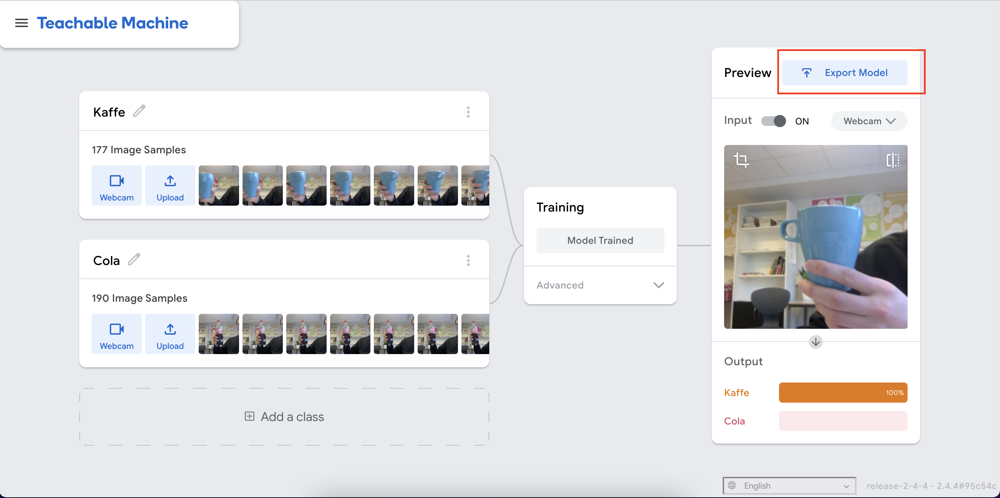
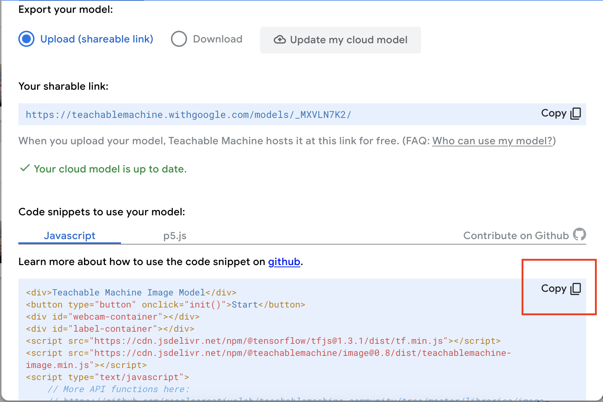
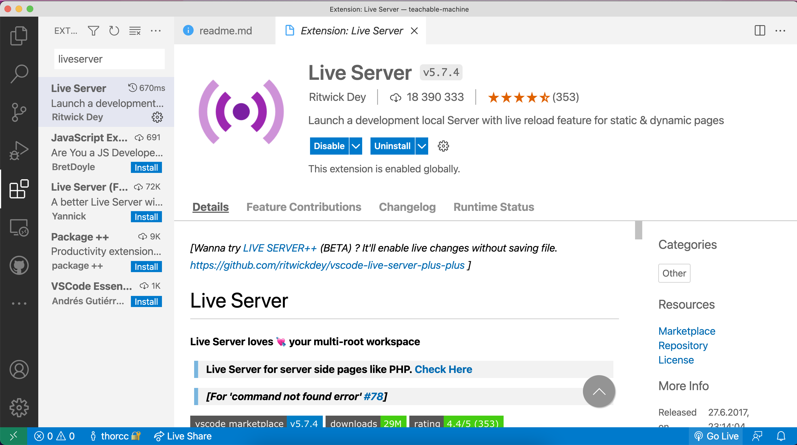

# Teachable Machine - en enkel guide

1. Gå inn på [https://teachablemachine.withgoogle.com/](https://teachablemachine.withgoogle.com/), og velg `get started`

2. Velg `image project`

3. Velg `standard image model`

4. Gi nytt navn til klassene, og velg `webcam` for å ta opp bilder

5. Tren modellen

6. Velg `export model`

7. Velg `upload my model` for å laste modellen opp på googles servere

8. Kopier koden, og lim den inn i en `.html`-fil

9. Last ned `live server` til VS Code

10. Velg `Go live` fra html-filen

11. Trykk start

